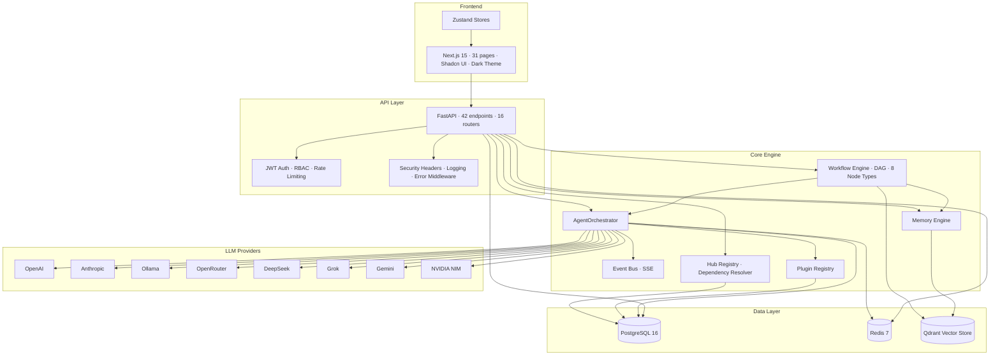
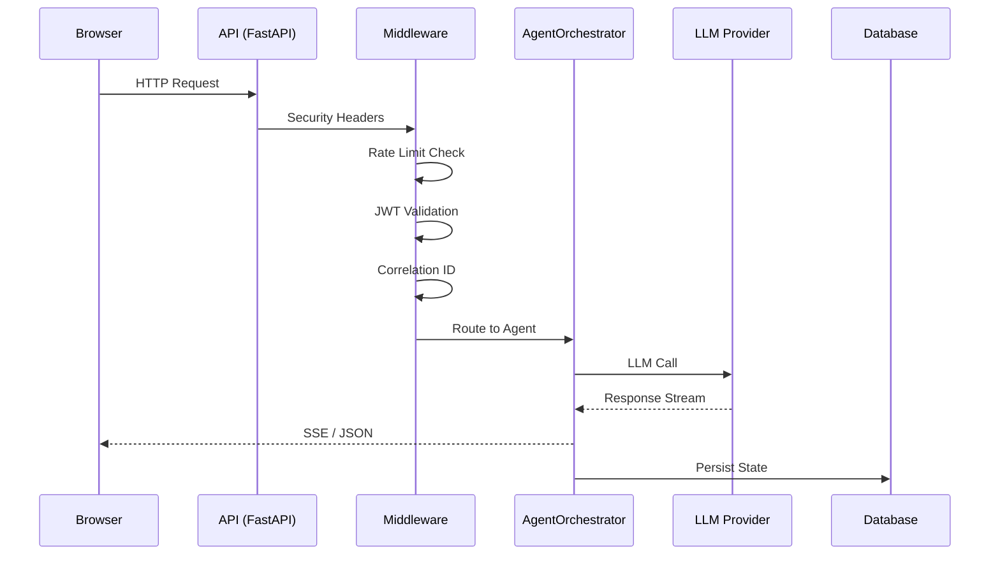

<div align="center">
  
  <br/>
  <h1>OpenPaper AI</h1>
  <p><strong>Enterprise-grade AI agent management platform</strong></p>
  <p>
    Multi-agent orchestration · Provider-agnostic LLM routing · Visual workflow builder · Package registry
  </p>

  <!-- Badges -->
  <p>
    <a href="#"></a>
    <a href="#"></a>
    <a href="#"></a>
    <a href="#"></a>
    <a href="#"></a>
    <a href="#"></a>
    <a href="#"></a>
    <br/>
    <a href="#features">Features</a> ·
    <a href="#architecture">Architecture</a> ·
    <a href="#quick-start">Quick Start</a> ·
    <a href="#cli">CLI</a> ·
    <a href="#documentation">Docs</a> ·
    <a href="#contributing">Contributing</a>
  </p>
</div>

---

**OpenPaper AI** is an open-source enterprise platform for orchestrating AI agents across any LLM provider. Build visual workflows, manage agent teams, search knowledge bases, and publish agents through a built-in package registry — all with a premium dark UI.

> **v1.0.0-rc.1** — Release Candidate. Ready for staging and evaluation.

---

## Features

<div align="center">

| Capability | Description |
|---|---|
| **4 Specialist Agents** | CEO (delegation), Sales (lead gen), Research (market intel), Buyer Finder (export trade) |
| **8 LLM Providers** | OpenAI, Anthropic Claude, Ollama, OpenRouter, DeepSeek, Grok, Gemini, NVIDIA NIM |
| **Visual Workflow Builder** | Drag-and-drop DAG editor with 8 node types (React Flow) |
| **Agent Graph** | Real-time agent communication visualization with SSE event streaming |
| **Knowledge Base** | PDF/DOCX/XLSX ingestion, vector embeddings, semantic search (Qdrant) |
| **Analytics Dashboards** | Provider health, cost tracking, agent/workflow performance, system monitoring |
| **Package Registry** | npm/pip-like CLI — search, install, publish agents with semver + signatures |
| **Marketplace** | 21 built-in items with one-click install |

</div>

## Architecture



### Request Lifecycle



## Quick Start

### Option 1: Docker Compose (Recommended)

```bash
# Clone and start all services
git clone https://github.com/openpaper-ai/openpaper.git
cd openpaper
cp .env.example .env
docker compose up -d

# Access the dashboard
open http://localhost:3000

# Verify the API
curl http://localhost:8000/api/health
```

### Option 2: Development Setup

**Backend:**
```bash
cd apps/api
pip install -e ".[dev]"
cp .env.example .env   # configure API keys
alembic upgrade head
uvicorn app.main:app --reload --port 8000
```

**Frontend:**
```bash
cd apps/web
npm install
npm run dev
```

**CLI:**
```bash
cd openpaper_cli
pip install -e .
openpaper --help
```

## CLI

The `openpaper` CLI manages both the platform and the Hub package registry:

```bash
# System
openpaper doctor          # Run diagnostics
openpaper onboard         # Setup wizard
openpaper run             # Start services

# Management
openpaper models --list   # List AI models
openpaper agents --list   # List agents
openpaper plugins --list  # List plugins

# Hub Registry
openpaper search export   # Search packages
openpaper install agent   # Install with deps
openpaper publish ./pkg   # Publish a package
openpaper login           # Authenticate
```

Full reference: [docs/cli.md](docs/cli.md)

## Documentation

| Guide | Description |
|---|---|
| [📖 Quickstart](docs/quickstart.md) | Get running in 5 minutes |
| [🏗️ Architecture](docs/architecture.md) | System design, data flow, component diagrams |
| [🐳 Docker Guide](docs/docker.md) | Production deployment with Traefik SSL |
| [🖥️ CLI Guide](docs/cli.md) | All 16 CLI commands with examples |
| [🏪 Marketplace Guide](docs/marketplace.md) | Publishing and installing packages |
| [⚙️ Workflow Guide](docs/workflow.md) | Building automation pipelines |

## API Overview

| Group | Routes | Description |
|---|---|---|
| `auth` | 5 | Register, login, refresh, revoke |
| `agents` | 7 | CRUD + execute + delegate with SSE |
| `chat` | 6 | CRUD + streaming completions |
| `tasks` | 5 | CRUD with priority levels |
| `workflows` | 10 | CRUD + execute + run monitoring |
| `documents` | 8 | Upload, chunk, semantic search |
| `analytics` | 7 | Providers, costs, agents, workflows |
| `marketplace` | 6 | Browse, install, update, uninstall |
| `hub/registry` | 14 | Publish, resolve, sync, verify |

Full interactive API docs at `http://localhost:8000/docs` when running.

## Tech Stack

| Layer | Technology |
|---|---|
| **Frontend** | Next.js 15, TypeScript, Shadcn UI, Zustand, React Flow 12, Recharts, Tailwind CSS |
| **Backend** | Python 3.12, FastAPI, SQLAlchemy 2.0 (async), Alembic, Pydantic v2 |
| **Database** | PostgreSQL 16, Redis 7, Qdrant (vector store) |
| **Infrastructure** | Docker Compose, Traefik, GitHub Actions (CI/CD) |
| **Security** | JWT (HS256), bcrypt, Fernet encryption, CSP/HSTS/XFO, rate limiting |
| **CLI** | Python, Typer, Click, Rich, httpx |

## Environment Variables

| Variable | Required | Default | Description |
|---|---|---|---|
| `SECRET_KEY` | Yes | — | JWT signing secret (256-bit) |
| `ENCRYPTION_KEY` | Yes | — | Fernet key for provider secrets |
| `DATABASE_URL` | No | `postgresql+asyncpg://...` | PostgreSQL connection |
| `REDIS_URL` | No | `redis://localhost:6379/0` | Redis connection |
| `OPENAI_API_KEY` | No | — | OpenAI provider key |
| `ANTHROPIC_API_KEY` | No | — | Anthropic provider key |
| `LOG_LEVEL` | No | `info` | Log verbosity |

## Screenshots

> <!-- Screenshots are available in the `screenshots/` directory. -->
> See the [Screenshots Guide](screenshots/README.md) for captured demos.

## Contributing

Please read [CONTRIBUTING.md](CONTRIBUTING.md) for details on our code of conduct, development workflow, and the process for submitting pull requests.

## License

MIT License — see [LICENSE](LICENSE).

## Security

See [SECURITY.md](SECURITY.md) for our vulnerability reporting process and security measures.
