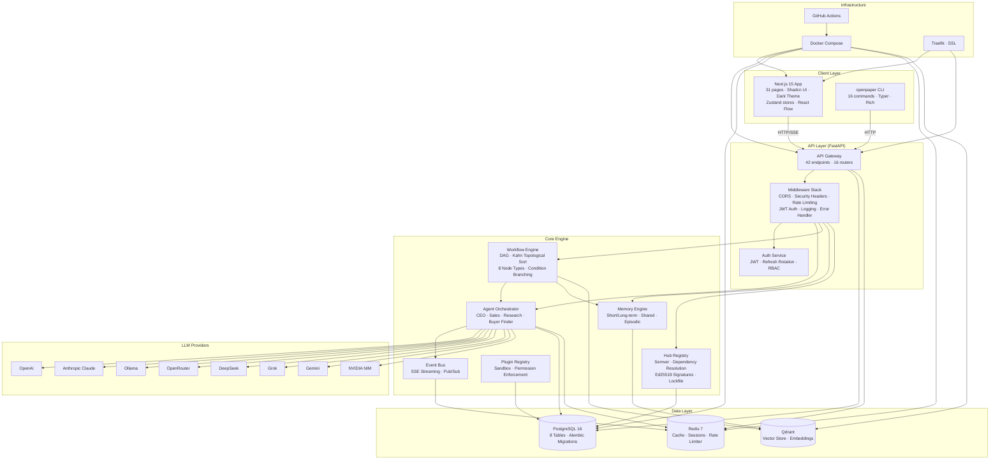
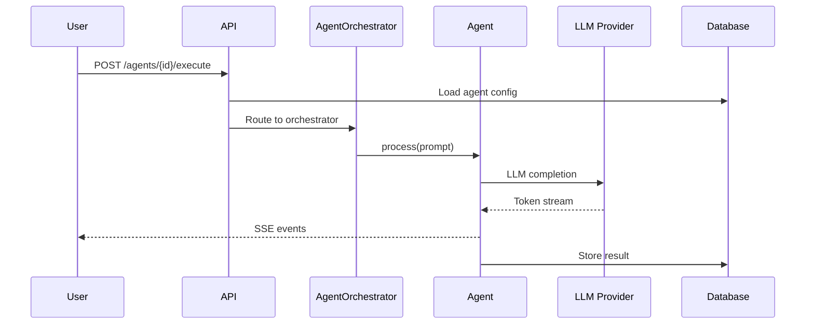
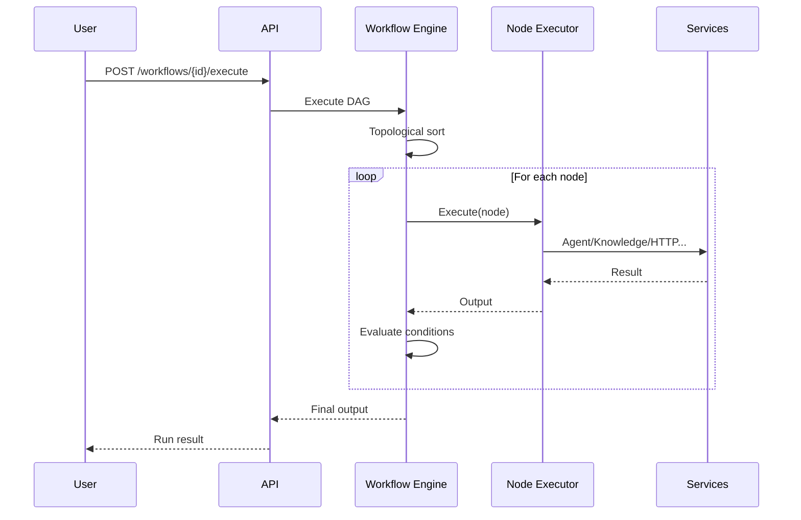
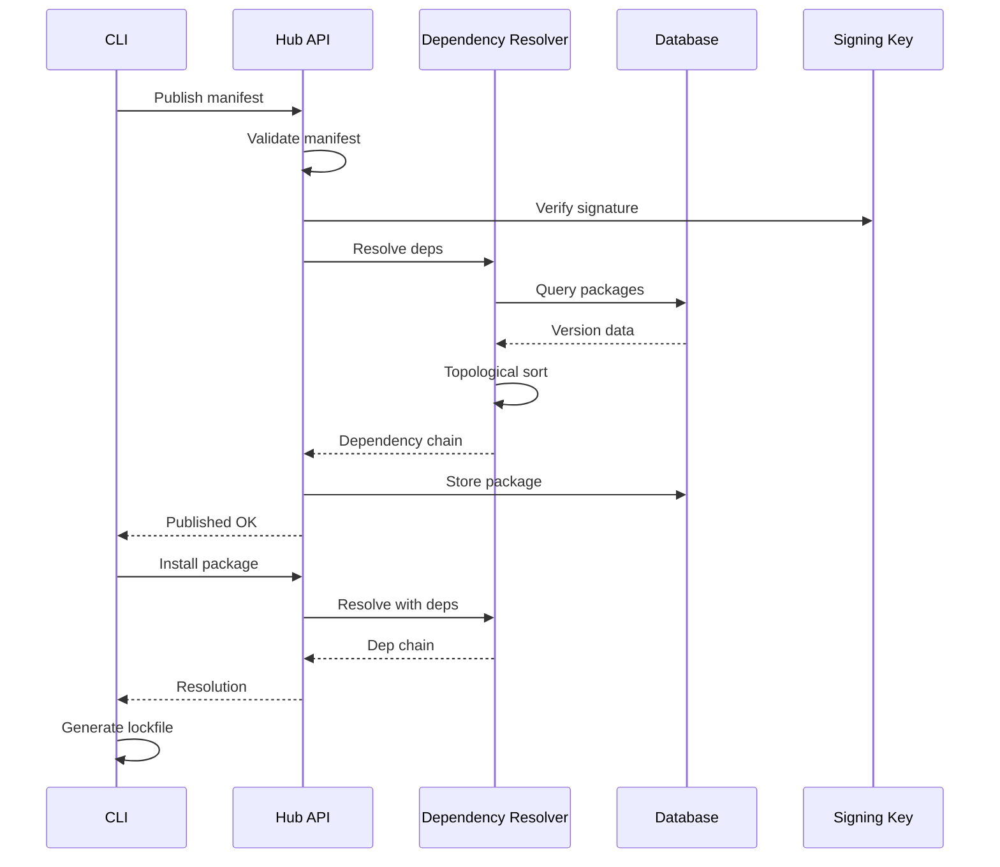
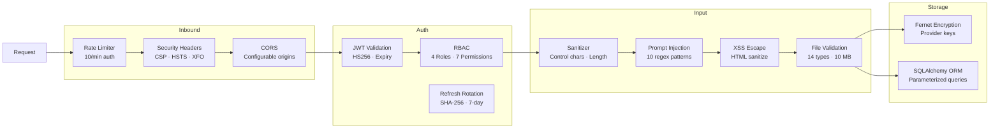
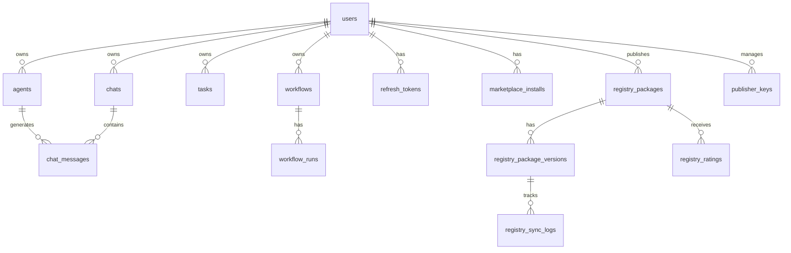

# Architecture

> **OpenPaper AI** — System design, component relationships, and data flow.

## System Architecture



## Component Architecture

### Frontend (Next.js 15)

```
src/
├── app/                          # Next.js App Router (31 pages)
│   ├── (dashboard)/              # Authenticated layout
│   │   ├── dashboard/            # KPI cards, recent activity
│   │   ├── agents/               # Agent CRUD grid
│   │   ├── chat/                 # Multi-panel chat
│   │   ├── tasks/                # Task management
│   │   ├── workflows/            # Workflow list + editor + runs
│   │   ├── agent-graph/          # Agent graph visualization
│   │   ├── analytics/            # Analytics dashboards
│   │   ├── documents/            # Document management
│   │   ├── knowledge/            # Knowledge base
│   │   ├── marketplace/          # Package marketplace
│   │   ├── providers/            # Provider status
│   │   ├── models/               # Model listing
│   │   ├── plugins/              # Plugin management
│   │   ├── memory/               # Memory explorer
│   │   └── settings/             # Profile + preferences
│   ├── login/                    # Authentication
│   └── register/                 # Registration
├── components/
│   ├── layout/                   # Sidebar, navbar, container
│   └── ui/                       # Button, Input, Card, Skeleton, etc.
└── stores/                       # 10 Zustand stores
```

### Backend (FastAPI)

```
app/
├── api/                          # 16 route modules
│   ├── auth.py                   # JWT + refresh auth
│   ├── agents.py                 # Agent CRUD + execute
│   ├── chat.py                   # Chat + SSE streaming
│   ├── tasks.py                  # Task CRUD
│   ├── workflows.py              # Workflow CRUD + engine
│   ├── documents.py              # Document upload + search
│   ├── agent_graph.py            # Graph visualization
│   ├── analytics.py              # Analytics endpoints
│   ├── marketplace.py            # Marketplace CRUD
│   ├── hub_registry.py           # Hub package registry
│   └── ... (health, bus, memory, etc.)
├── agents/                       # Agent implementations
│   ├── orchestrator.py           # Singleton agent router
│   ├── ceo.py                    # CEO delegation agent
│   ├── sales.py                  # Sales lead gen agent
│   ├── research.py               # Market research agent
│   └── buyer_finder.py           # Export buyer agent
├── core/                         # Core services
│   ├── workflow_engine.py         # DAG execution engine
│   ├── event_bus.py              # Pub/sub event system
│   ├── plugin_registry.py        # Plugin sandbox
│   ├── hub_resolver.py           # Semver dependency resolver
│   ├── hub_signer.py             # Ed25519 signatures
│   └── ... (security, encryption, etc.)
├── models/                       # SQLAlchemy models
├── schemas/                      # Pydantic schemas
└── providers/                    # LLM provider wrappers
```

## Data Flow

### Agent Execution



### Workflow Execution



### Package Registry (Hub)



## Security Architecture



## Database Schema



## Container Architecture

```yaml
services:
  postgres:16-alpine       # Port 5432 - Primary database
  redis:7-alpine            # Port 6379 - Cache & pub/sub
  qdrant:latest             # Port 6333 - Vector store
  api:                      # Port 8000 - FastAPI (healthcheck)
    depends_on: [postgres, redis]
    build: apps/api/Dockerfile
  web:                      # Port 3000 - Next.js (healthcheck)
    depends_on: [api]
    build: apps/web/Dockerfile
  traefik:                  # Port 443 - Reverse proxy + SSL
    optional: production only
```

All services share the `openpaper-net` bridge network and use JSON-file logging with 10 MB max size and 3-file rotation. Resource limits: API (1 GB), Web (512 MB), Postgres (512 MB), Redis (256 MB).

## Component Dependency Graph

| Component | Depends On | Used By |
|---|---|---|
| AgentOrchestrator | LLM Providers, Memory Engine | API, Workflow Engine |
| Workflow Engine | AgentOrchestrator, Knowledge Base, Memory Engine | API |
| Event Bus | Redis | AgentOrchestrator, API |
| Plugin Registry | PostgreSQL | API, Marketplace |
| Hub Registry | PostgreSQL, Dependency Resolver | API, CLI |
| Memory Engine | Qdrant | AgentOrchestrator, Workflow Engine |
| Dependency Resolver | — | Hub Registry |
| Rate Limiter | Redis (optional, in-memory fallback) | API Middleware |
